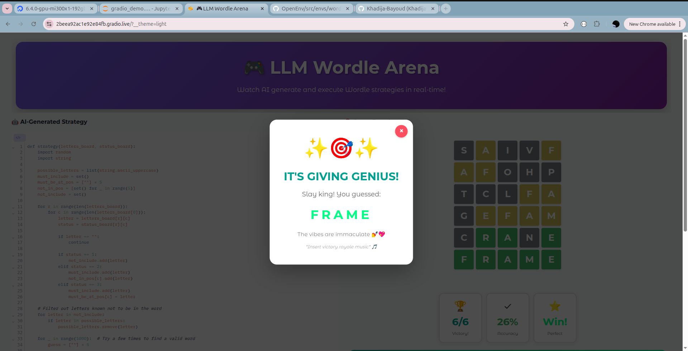

# Unsloth AMD PyTorch Synthetic Data AI Agent Hackathon

 

# 🎯 GRPO for GPT-OSS 20B: Playing Wordle Game

Welcome to our submission for the **Synthetic Data AI Agent Challenge**! In this project, We teahces a **large language model (GPT-OSS 20B)** to play **Wordle** using **reinforcement learning** and a carefully designed environment. 

🟩⬛⬛⬛⬛ 
⬛🟨⬛⬛⬛ 
⬛⬛🟩⬛⬛ 
⬛⬛⬛🟩⬛ 
⬛⬛⬛⬛🟩 

# 🏆 Challenge Overview

This challenge track had three major components, and We approached each step with a combination of **Pytorch-OpenEnv**, **Unsloth**, and high-performance **AMD** hardware:

## 1️⃣ Designing the Wordle RL Environment

We created a **custom reinforcement learning environment** for **Wordle** using the **OpenEnv framework**.  
- Models Wordle as an RL task: agent proposes guesses and receives feedback.  
- Supports strategy testing and evaluation.

💻 GitHub link to the environment: 🟩 [OpenEnv Wordle Environment](https://github.com/Khadija-Bayoud/OpenEnv/tree/wordle_env/src/envs/wordle_env) 🟩

---

## 2️⃣ Fine-tuning GPT-OSS 20B

We fine-tuned **GPT-OSS 20B** to play **Wordle** using reinforcement learning guided by the environment.

- Fine-tuning was done using **Unsloth** for faster and memory-efficient training.
- **Hardware used for training:**
  - **GPU:** MI300, 1 GPU, 192 GB VRAM  
  - **vCPU:** 20 cores  
  - **RAM:** 240 GB  
  - **Boot Disk:** 720 GB NVMe SSD  
  - **Scratch Disk:** 5 TB NVMe SSD  

- Colab notebook for the fine-tuning process (note: large outputs are truncated):  
🟩 [Colab: Fine-tuning GPT-OSS 20B](https://drive.google.com/file/d/1Rus_1ZYHyqgCKjh-2jtasjSbUL34uPZN/view?usp=sharing) 🟩

## 3️⃣ A Video Demonstration

W developed a **Gradio interface** that demonstrates the model in action:  
- Model **outputs a strategy** based on the **Wordle** board.  
- Strategy is **executed using the OpenEnv Wordle environment**, showing real-time gameplay.

🎥 Watch the demo video: 🟩 [Wordle AI Agent in Action](https://drive.google.com/file/d/1OxWqeE-hZC4vehZHR9nktLT0LO3DDWiv/view?usp=sharing) 🟩 (There is also a win/lost crazy sound in the demo, so sad didn't get recorded! I should submit :)!

---

# ⚡ Technologies & Tools

- **Pytorch-OpenEnv:** Agentic Execution Environments Framework 
- **Unsloth:** Efficient fine-tuning of LLMs  
- **GPT-OSS 20B:** OpenAI LLM fine-tuned for Wordle  
- **Gradio:** Interactive frontend for demoing strategies  

---

# 📝 Summary

This hackathon demonstrates:

- How **RL environments** can be used to train LLMs for interactive tasks.  
- How **hardware-optimized training** with **Unsloth** accelerates large-scale LLM fine-tuning.  
---

## 🎉 🎉 We had an absolute blast participating in the Synthetic Data AI Agent Challenge. This hackathon was as fun as it was inspiring! 😄
